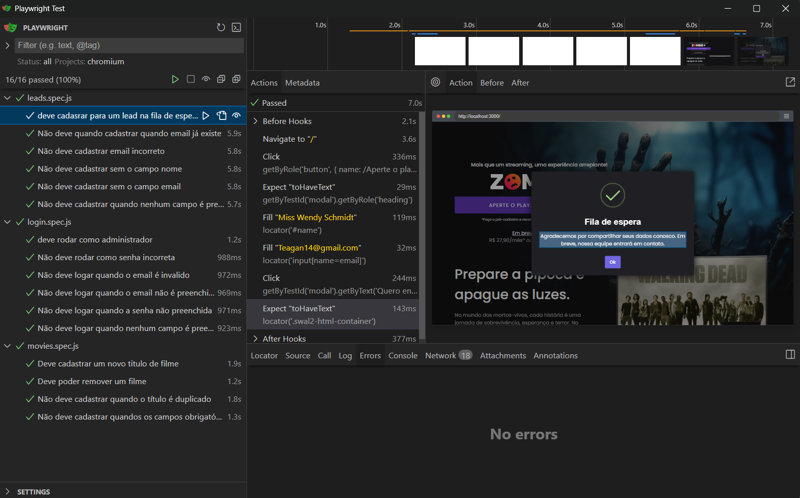
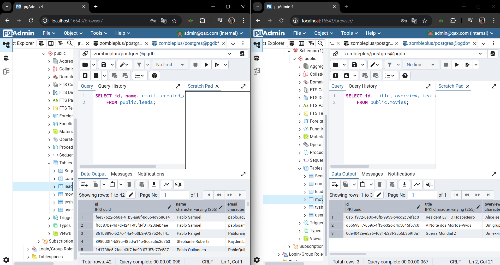

##  Sobre

Repositório do projeto de testes automatizados com Playwright

##  Tecnologias
- Node.js
- Playwright
- Javascript
- Faker
- PostgreSQL

##  Como executar

1. Clonar o repositório, instalar as dependências
```
npm install
```

2. Executar testes em Headless
```
npx playwright test 
```

3. Executar ver o relatório dos testes
```
npx playwright show-report
```
4. Executar interface para visualização dos testes.
```
npx playwright test --ui
```


```
Banco de dados
O projeto executa testes que interagem diretamente com o banco PostgreSQL, realizando inserções e exclusões.
```



